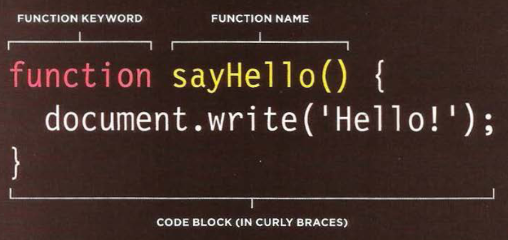
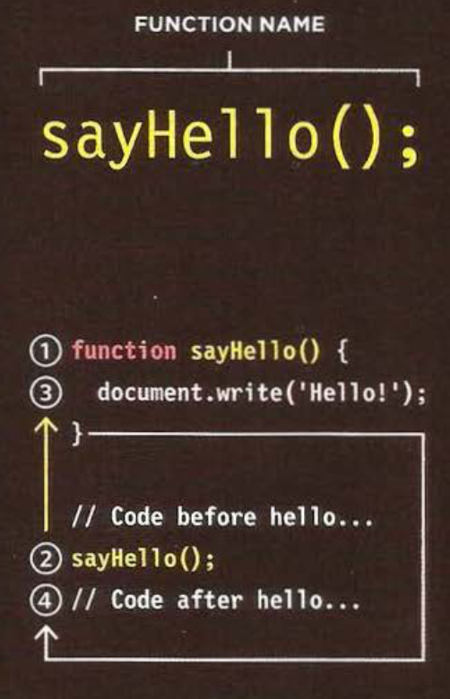
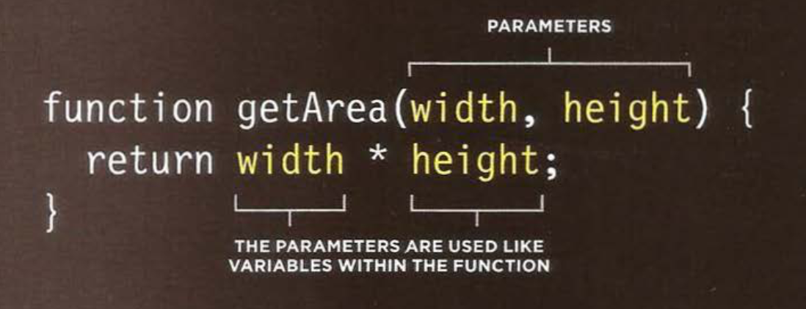
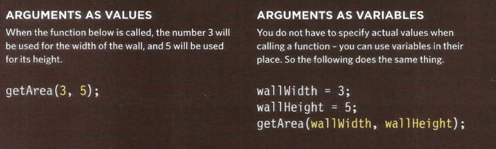

# Class 04 Notes

## 6 Reasons for Pair Programming
- the practice of two developers sharing a single workstation to interactively tackle a coding task together
- involves two roles: the Driver and the Navigator
  - **Driver** - the programmer who is typing and the only one whose hands are on the keyboard
    - manages the text editor, switching files, version control, and—of course writing—code
  - **Navigator** - uses their words to guide the Driver but does not provide any direct input to the computer
    - thinks about the big picture, what comes next, how an algorithm might be converted in to code, while scanning for typos or bugs
    - can use 2nd screen to look up answers
    - **no coding**
### Why pair program?
1. Greater efficiency
2. Engaged collaboration
3. Learning from fellow students
4. Social skills
5. Job interview readiness
6. Work environment readiness

## Layout
- Browsers display pages in normal flow unless you specify relative, absolute, or fixed positioning
- The float property moves content to the left or right of the page and can be used to create multi-column layouts. (Floated items require a defined width.)
- Pages can be fixed width or liquid (stretchy) layouts
- Designers keep pages within 960-1000 pixels wide, and indicate what the site is about within the top 600 pixels (to demonstrate its relevance without scrolling)
- Grids help create professional and flexible designs
- CSS Frameworks provide rules for common tasks
- You can include multiple CSS files in one page

## Layout
- Links are created using the `<a>` element
- The `<a>` element uses the href attribute to indicate
the page you are linking to
- If you are linking to a page within your own site, it is best to use relative links rather than qualified URLs
- You can create links to open email programs with an email address in the "to" field
- You can use the id attribute to target elements within a page that can be linked to

### Functions

- **Functions** let you group a series of statements together to perform a specific task p90-95
 - If different parts of a script repeat the same task, you can reuse the function
- rely on *name* / *value* pairs
''
- will not run until the function is *called*

### Declaring a function:

### Calling a function

### Declaring functions that need information:

### Calling functions that need info

