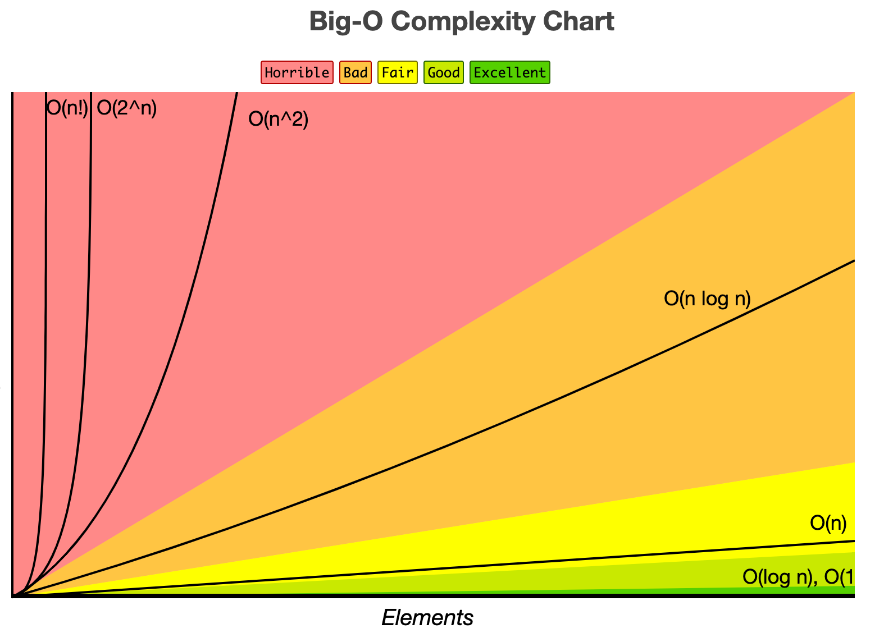

# Reading 01

## A beginner's guide to Big O Notation

- Big O notation is used to describe the performance or complexity of an algorithm

## O(1)

- algorithm will always execute in the same time (or space) regardless of the size of the input data set

## O(N)

- algorithm whose performance will grow linearly and in direct proportion to the size of the input data set
- Big O favours the worst-case performance scenario
  - always assume the upper limit, the maximum # of iterations
- ex. `foreach`

## O(N^2)

- algorithm whose performance is directly proportional to the square of the size of the input data set
- common with algos that involve nested iterations
  - deeper nests result in O(N^3), O(N^4)
- ex nested `for` loops

## O(2^N)

- algorithm whose growth doubles with each addition to the input data set
- exponential — starting off very shallow, then rising meteorically
- ex recursive calculation of Fibonacci numbers

## O(log N)

- peaks at beginning and slowly flattens out as size of data set increase
  - e.g. 10 items takes 1 sec, 100 items 2 sec, 1,000items 3 sec
  - doubling the set has little effect on growth

[A beginner's guide to Big O Notation](https://rob-bell.net/2009/06/a-beginners-guide-to-big-o-notation)

