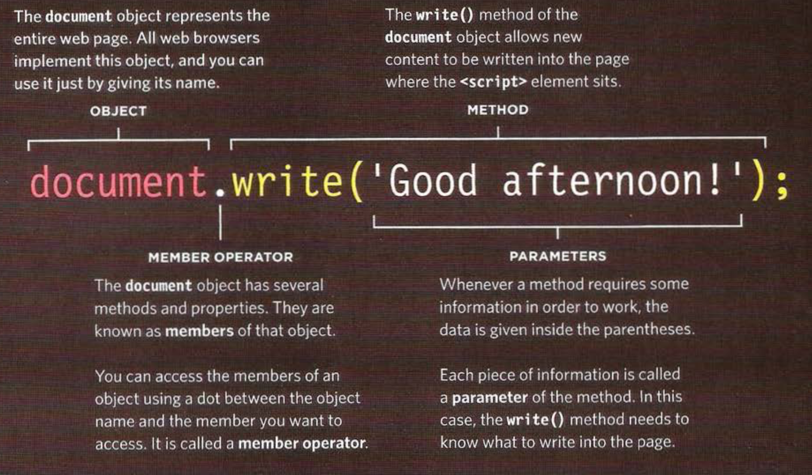
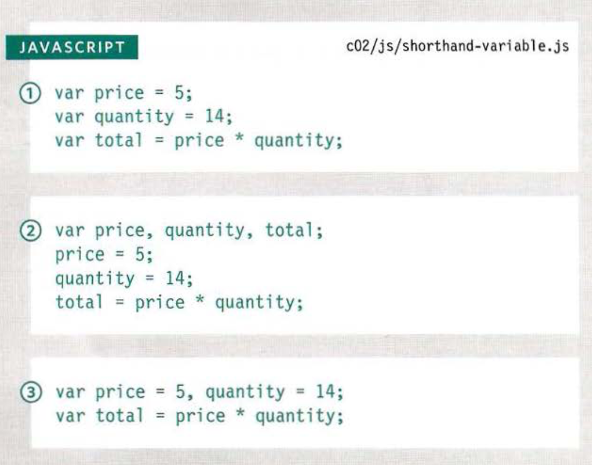

# Dynamic web pages with JavaScript

## Some notes

### How HTML, CSS, & JAVASCRIPT fit together
- `<html>`: content layer
- `{css}`: presentation layer
- `javascript()`: Behavior layer

### Linking to a Javascript file from and HTML page
- use the HTML `` tags
  - better to put scripts in their own files

### Using Ojects & Methods:
- Referred to as *calling* a method of an object
- where `<script>`element is placed effects where written into page

### Basic Javascript Instructions
- **statement** - each individual instruction or step
  - should end with `;`
- `{}`: curly braces indicate start and end of code block
- Javascript is **case** **sensitive**
- **comments** explain what your code does
  - They help make your code easier to read and understand
  - `//' single-line comments
  - `/* */` multi-line comments
- **variable** temporarily store the bits of information
  - a good name for this concept because the data stored in a variable can change (or vary) each time a script runs
  - **declare** the variable, announce that you want to use it

  
  - if more than 1 word written in _camelCase_

- `\`: **escaping** the quotation
  - place `\` (backslash) before any type of quote mark
- **Boolean** variables can be used to trigger different CSS class rules

### Short hand for creating variables
1. Variables declared and values assigned in the same statement
2. Three variables are declared on the same line, then values assigned to each
3. Three variables are declared on the same line, then values assigned to each

### Rules for naming variables
- The name must begin with a letter, dollar sign `($)`,or an underscore `(_)`
  - **Cannot** start with a number
- Must not use a dash `(-)` or a period `(.)` in a variable name
- Cannot use **keywords** or **reserved** words
- All variables are case sensitive
- Use a name that describes the kind of info the variable stores
- If your variable name is made up of more than one word, use a capital letter for the first letter of every word after the first word. For example, *firstName*
  - can also use underscore, *cannot* use a dash