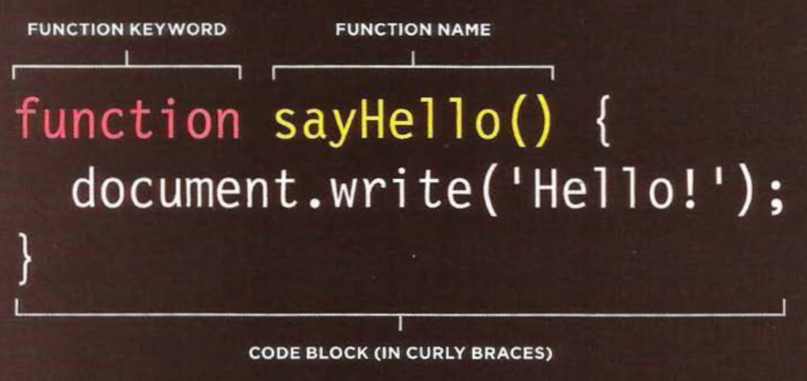

# Programming with JavaScript

Duckett: JavaScript & jQuery:
Intro + Scripts: Pages 1 - 24
Expressions + Operators: 74 - 79
Functions: 88 - 94

## Here are my notes

### What is a Script

- A **script** is a series of instructions that a computer can follow to achieve a goal
- Comparable to recipes, handbooks, and manuals - instructions to follow step-by-step
  - it might only use a subset of all instructions
- Remeber computers solve problems *programatically*

### Writing is a Script

1. DEFINE THE GOAL
  - detail goals of the script
  - break into a series of tasks to be performed in order to achieve the goals
2. DESIGN THE SCRIPT
  - a sequence of steps
3. CODE EACH STEP - spend time designing script - represented in flowchart
  - flowcharts show how tasks fit together & show paths btwn each step

### Expressions & Operators

- An **expression** evaluates into (results in) a single value
- Broadly speaking there are two types:
  - EXPRESSIONS THAT JUST ASSIGN A VALUE TO A VARIABLE
    - ex. var color = 'beige';
  - EXPRESSIONS THAT USE TWO OR MORE VALUES TO RETURN A SINGLE VALUE
    - var area = 3 * 2;
- **operators** allow programmers to create a single value from one or more values
  - ASSIGNMENT OPERATORS - Assign a value to a variable
    - `color = 'beige';`
  - ARITHMETIC OPERATORS - Perform basic math p.77
    - `area = 3 * 2;`
    - ADDITION: + Adds one value to another
    - SUBTRACTION: - Subtracts one value to another
    - DIVISION: / - Divides two values
    - MULTIPLICATION: * - Multiplies t wo values using an asterisk
    - INCREMENT: ++ - Adds one to the current number i = 10; i++ = 11
    - DECREMENT: -- - Subtracts one from the current number i = 10; i-- = 9
    - MODULUS: % - Divides two values and returns the remainder

  - STRING OPERATORS - Combine two strings p.79
    - `greeting= 'Hi 1 + 'Molly';`
    - only + operator
    - var cost1 = '7'; var cost2 = '9'; end up with string saying  '79'

### Functions

- **Functions** let you group a series of statements together to perform a specific task p90-95
 - If different parts of a script repeat the same task, you can reuse the function
- rely on *name* / *value* pairs
''
- will not run until the function is *called*

### Declaring a function:

### Calling a function

### Declaring functions that need information:

### Calling functions that need info

